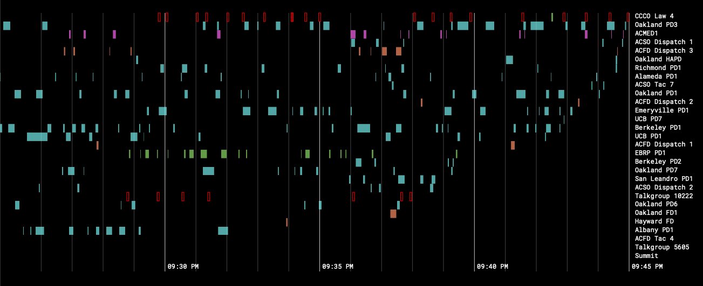

East Bay Live was an experimental timeline-based police, fire, and EMS scanner application.

While many radios still operate on a paradigm of channels, in reality, the modern "trunked" radio systems used by police and other organizations use only a small number of real frequency channels to support dozens of virtual channels. This allows a software-defined radio to listen to every "channel" simultaneously, and suggests alternative paradigms for police monitoring, open source research and accountability.

East Bay Live ran in the summer of 2020, in the first months of the coronavirus pandemic. After improving my antenna, I discovered it was possible to receive prison guard radio transmissions from San Quentin State Prison, 25km away from my ground floor Oakland apartment. While many of the messages in SQSP were encrypted, requests for medical assistance were not — a potentially important data point as officials attempted to understate the severity of a COVID cluster at the prison.

In August 2020, I moved away from the Bay Area and ended the project.

<a href="https://subject.space/projects-static/ebrcs/">Listen to an archive of East Bay Live.</a>

<a href="https://github.com/loganwilliams/ebrcs">East Bay Live is open source.</a>
