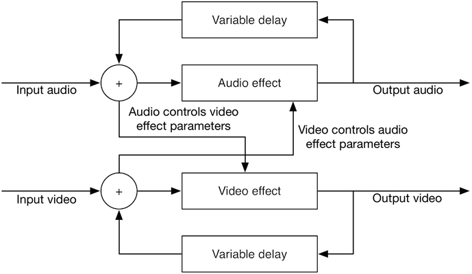
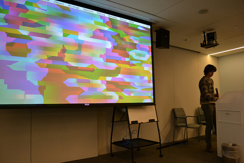
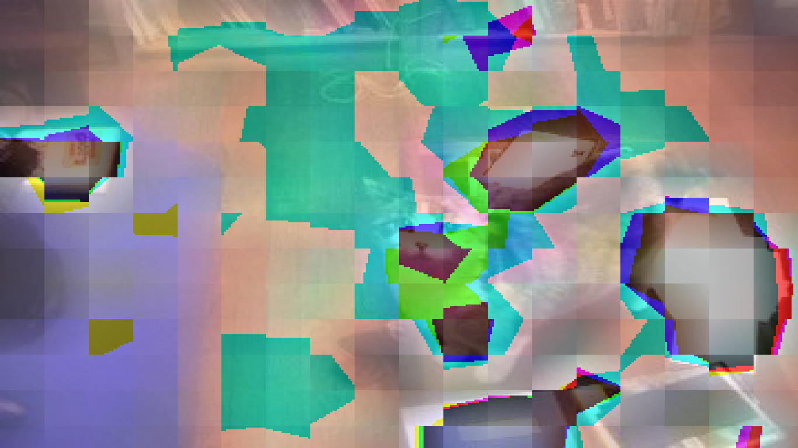

A project in Max/MSP for <a href="http://new.musichackday.org">Music Hack Day Boston</a> with Drew Shapiro.

Feedback and control loops frequently cross multiple domains &mdash; mechanical and electrical, discrete and continuous, and software and hardware. When used as an artistic device however, this is less common. The feedback is frequently electrical and acoustic, but rarely is video introduced into the loop. For this project, we explored the artistic effects of a feedback loop that involved all of these elements. A block diagram view of the structure of our system is shown below, as well as several example results.

	

<iframe src="https://player.vimeo.com/video/79360500" width="500" height="375" frameborder="0" webkitallowfullscreen mozallowfullscreen allowfullscreen></iframe> 
<a href="https://vimeo.com/79360500">BASKETBALL</a> from <a href="https://vimeo.com/user12334027">Logan Williams</a> on <a href="https://vimeo.com">Vimeo</a>.

<table class="gallery">

	<tr>
		<td>
		<td>
	</tr>
	<tr>
		<td>Presenting a demo at Music Hack Day.</td>
		<td>Still image generated by with transdomain feedback.</td>
	</tr>
</table>

The Max patches are available on <a href="https://github.com/loganwilliams/trans-domain-feedback">Github</a>.

